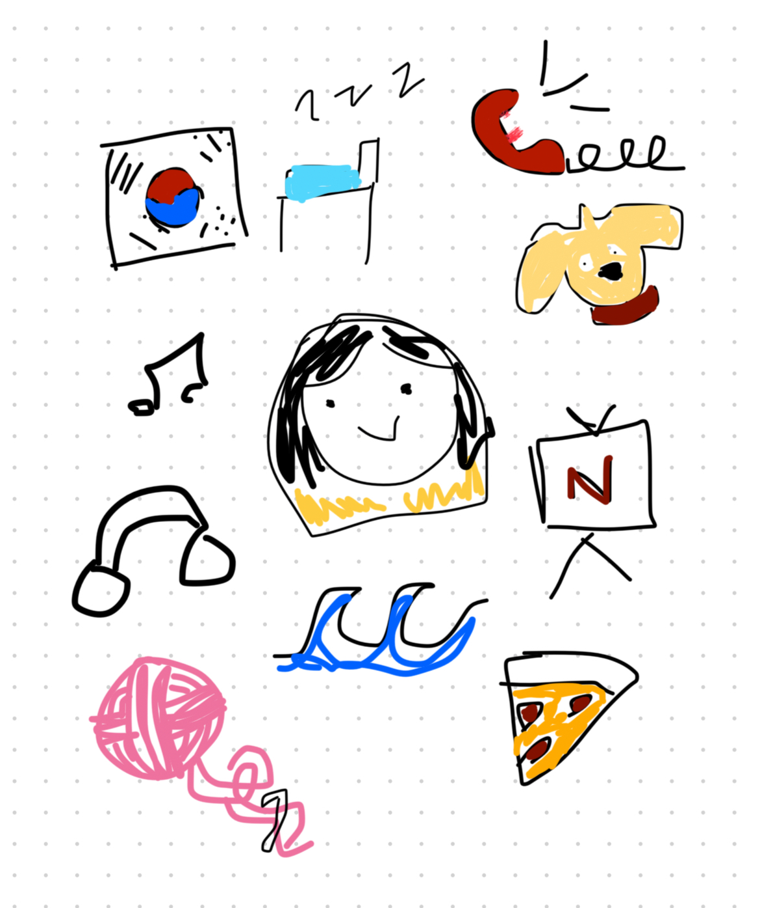

# Get to know me! {#headings}
> Me
>> name: Katie Kim
>>
> age: 10th grade, DNHS
>>
> hobbies: listening to music, crocheting, shopping
>>

> I took CSSE to explore my interests and see whether this would be a fitting career path. I had no prior coding experience and struggled a lot in this class because of self teaching. [W3Schools](https://www.w3schools.com/) was really helpful, but AI was the easiest way for me to gain quick coding knowledge. 
> I liked html and sass, but now I prefer coding things like games rather than designing with CSS. The mario game was really fun, especialy considering that it was one large group project. I worked with local storage and creating leaderboards, and I got comfortable with Object Oriented Programming (fondly referred to as OOP).

### Old Image ###
This is a quick image I drew to represent myself (to the best of my abilitiy)

